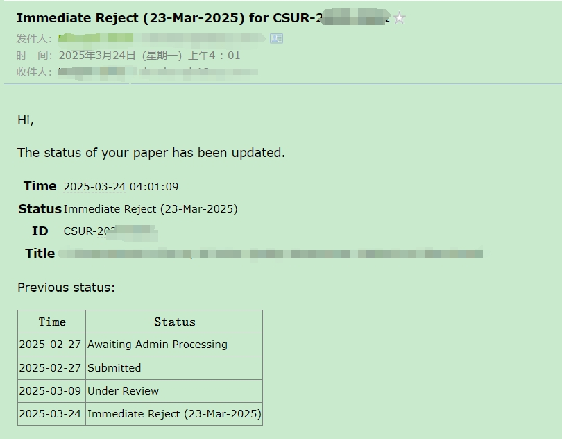

[EN](README.md) | [ZH](README-zh.md)

# 自动查询论文提交状态

有些投稿系统不能实时提醒作者论文状态，而作者往往比较关心投稿到了哪一步，会不停地刷新系统，尤其是对期刊这种不定时间的投稿形式。这种手动查询不仅耗时耗力，还可能错过重要的状态更新。

为了解决这一问题，开发了一个工具，利用爬虫程序和定时功能自动检测文章状态。该工具可以定期查询论文的提交状态，并通过邮件通知作者最新进展，从而节省时间，提高效率，帮助作者专注于更重要的研究工作。

## 概述

本文档提供了使用**自动查询论文提交状态**工具的说明，该工具帮助研究人员跟踪其论文在各种期刊系统中的提交状态。



## 支持的系统

该工具支持以下系统的论文提交状态跟踪：

1. **ScholarOne Manuscripts**  
   一个广泛使用的学术期刊投稿和同行评审系统，例如 IEEE Transactions 期刊 (TIP, TPAMI)。

2. **Editorial Manager (EM)**  
   一个全面的稿件提交和跟踪系统，例如 Elsevier 期刊和 Springer 期刊 (IJCV)。

## 邮件配置

要启用查询结果的邮件通知，请在第三个 Jupyter 单元中配置发件人和收件人的邮件设置，如下所示：

```python
sender_email = "xx@qq.com"  # 发件人邮箱地址
receiver_email = "xx"  # 收件人邮箱地址
password = "xx"  # 发件人邮箱密码

smtp_server = "smtp.qq.com"  # 发件人邮箱的 SMTP 服务器
smtp_port = 587  # 如果偏好 SSL，请使用 465
```

将占位符 (`xx`) 替换为您的实际邮箱凭据和详细信息。确保您的邮箱凭据安全存储且不公开共享。

## 配置示例

使用该工具时，需要在脚本中配置 `system_dicts` 参数。以下是一个示例配置：

```python
# 对于 EM 系统
system_dicts = [
     {
          "URL": "https://www.editorialmanager.com/xx",  # 期刊 URL
          "userid": "xx",  # 用户 ID
          "password": "xx",  # 密码
          "cc": ["xx", "xx"],  # 抄送邮箱列表（可选）
     }
]

# 对于 ScholarOne 系统
system_dicts = [
     {
          "URL": "https://mc.manuscriptcentral.com/xx",  # 期刊 URL
          "userid": "xx",  # 用户 ID
          "password": "xx",  # 密码
          "cc": [
                "xx",
                "xx",
          ],  # 抄送邮箱列表（可选）
     }
]
```

将占位符 (`xx`) 替换为您的实际凭据和详细信息。确保您的凭据安全存储且不公开共享。

## 脚本调度示例

要自动执行论文状态查询的 Jupyter 笔记本，可以使用以下 Bash 脚本：

```bash
#!/bin/bash
source /{your conda path}/etc/profile.d/conda.sh

# 激活 base 环境
conda activate base

date;

# 执行 ScholarOne 查询笔记本
jupyter nbconvert --to notebook --execute /{your local path}/query_scholarone_paper_status.ipynb

date;

# 执行 Editorial Manager 查询笔记本
jupyter nbconvert --to notebook --execute /{your local path}/query_em_paper_status.ipynb

date;
```

将 `/{your conda path}/` 和 `/{your local path}/` 替换为您的 Conda 安装路径和笔记本路径。将此脚本保存为 `.sh` 文件，并使用 cron 作业或其他任务调度器按您希望的时间间隔运行。

## [设置 Cron 作业](https://www.runoob.com/w3cnote/linux-crontab-tasks.html)

使用 `crontab` 调度脚本，请按照以下步骤操作：

1. 打开 crontab 编辑器：

   ```bash
   crontab -e
   ```

2. 添加以下行以调度脚本（例如，每天凌晨 2 点运行）：

   ```bash
   0 2 * * * /bin/bash /{path_to_script}/query_paper_status.sh >> /{path_to_log}/query_status.log 2>&1
   ```

   将 `/{path_to_script}/` 替换为 `.sh` 脚本的路径，将 `/{path_to_log}/` 替换为日志文件的路径。

3. 保存并退出编辑器。

脚本将按指定时间自动运行，输出将记录到指定文件中。

## 输出文件

运行脚本后，将生成一个 `paper_status_history.csv` 文件。该文件包含您的论文提交历史状态，包括时间戳和状态更新。您可以使用此文件跟踪提交进度。

确保脚本执行目录具有写权限，以便成功保存 CSV 文件。

## 前置条件

1. **安装 Selenium**  
   使用 pip 安装 Selenium：

   ```bash
   pip install selenium
   ```

2. **下载 WebDriver**  
   [下载适合您浏览器的 WebDriver](https://blog.csdn.net/m0_57021623/article/details/132309298)。确保将 WebDriver 可执行文件添加到系统 PATH。

3. **安装所需的 Python 库**  
   安装工具所需的其他依赖项：

   ```bash
   pip install pandas jupyter
   ```

4. **设置 Conda 环境（可选）**  
   创建并激活 Conda 环境以更好地管理依赖项：

   ```bash
   conda create -n paper_status_env python=3.9 -y
   conda activate paper_status_env
   ```

   然后，在环境中安装所需库：

   ```bash
   pip install selenium pandas jupyter
   ```

5. **浏览器兼容性**  
   确保浏览器版本与 WebDriver 版本匹配，以避免兼容性问题。
