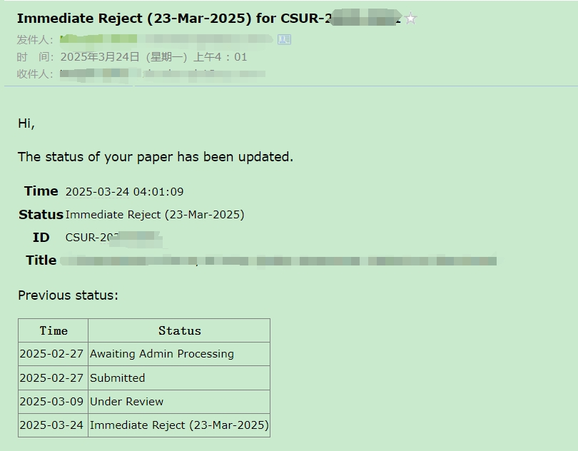

[EN](README.md) | [ZH](README-zh.md)

# Automatically Query Paper Submission Status 

## Overview

This document provides instructions for using the **Automatically Query Paper Submission Status** tool, which helps researchers track the status of their paper submissions across various journal systems.



## Supported Systems

This tool supports tracking paper submission status for the following systems:

1. **ScholarOne Manuscripts**  
    A widely used submission and peer-review system for academic journals, such as IEEE Transactions Journals (TIP, TPAMI).

2. **Editorial Manager (EM)**  
    A comprehensive manuscript submission and tracking system, such as Elsevier Journals, and Springer Journals (IJCV).

## Email Configuration

To enable email notifications for the query results, configure the sender and receiver email settings in the third Jupyter cell as follows:

```python
sender_email = "xx@qq.com"  # Sender's email address
receiver_email = "xx"  # Receiver's email address
password = "xx"  # Sender's email password

smtp_server = "smtp.qq.com"  # SMTP server for the sender's email
smtp_port = 587  # Use 465 if you prefer SSL
```

Replace the placeholders (`xx`) with your actual email credentials and details. Ensure that your email credentials are stored securely and not shared publicly.

## Configuration Example

To use this tool, you need to configure the `system_dicts` parameter in your script. Below is an example configuration:

```python
# for em system
system_dicts = [
     {
          "URL": "https://www.editorialmanager.com/xx",  # journal URL
          "userid": "xx",  # your user ID
          "password": "xx",  # your password
          "cc": ["xx", "xx"],  # CC email list (optional)
     }
]

# for scholarone system
system_dicts = [
     {
          "URL": "https://mc.manuscriptcentral.com/xx",  # journal url
          "userid": "xx",  # your user id
          "password": "xx",  # your password
          "cc": [
                "xx",
                "xx",
          ],  # cc emails, optional
     }
]
```

Replace the placeholders (`xx`) with your actual credentials and details. Ensure that your credentials are stored securely and not shared publicly.

## Scheduling Script Example

To automate the execution of the paper status query notebooks, you can use the following Bash script:

```bash
#!/bin/bash
source /{your conda path}/etc/profile.d/conda.sh

# Activate the base environment
conda activate base

date;

# Execute the ScholarOne query notebook
jupyter nbconvert --to notebook --execute /{your local path}/query_scholarone_paper_status.ipynb

date;

# Execute the Editorial Manager query notebook
jupyter nbconvert --to notebook --execute /{your local path}/query_em_paper_status.ipynb

date;
```

Replace `/{your conda path}/` and `/{your local path}/` with the actual paths to your Conda installation and notebooks, respectively. Save this script as a `.sh` file and schedule it using a cron job or any other task scheduler to run at your desired intervals.

## [Setting Up a Cron Job](https://www.runoob.com/w3cnote/linux-crontab-tasks.html)

To schedule the script using `crontab`, follow these steps:

1. Open the crontab editor:
    ```bash
    crontab -e
    ```

2. Add the following line to schedule the script (e.g., to run daily at 2 AM):
    ```bash
    0 2 * * * /bin/bash /{path_to_script}/query_paper_status.sh >> /{path_to_log}/query_status.log 2>&1
    ```

    Replace `/{path_to_script}/` with the path to your `.sh` script and `/{path_to_log}/` with the path to your log file.

3. Save and exit the editor.

The script will now run automatically at the specified time, and the output will be logged to the specified file.

## Output File

After running the script, a `paper_status_history.csv` file will be generated. This file contains the historical status of your paper submissions, including timestamps and status updates. You can use this file to track the progress of your submissions over time.

Ensure that you have write permissions in the directory where the script is executed to allow the CSV file to be saved successfully.

## Prerequisites

1. **Install Selenium**  
    Use pip to install Selenium:
    ```bash
    pip install selenium
    ```

2. **Download WebDriver**  
    [Download the appropriate WebDriver for your browser](https://www.selenium.dev/documentation/webdriver/getting_started/install_drivers/). Ensure the WebDriver executable is added to your system's PATH.

3. **Install Required Python Libraries**  
    Install additional dependencies required for the tool:
    ```bash
    pip install pandas jupyter
    ```

4. **Set Up Conda Environment (Optional)**  
    Create and activate a Conda environment for better dependency management:
    ```bash
    conda create -n paper_status_env python=3.9 -y
    conda activate paper_status_env
    ```
    Then, install the required libraries within the environment:
    ```bash
    pip install selenium pandas jupyter
    ```

5. **Browser Compatibility**  
    Ensure that the browser version matches the WebDriver version to avoid compatibility issues.